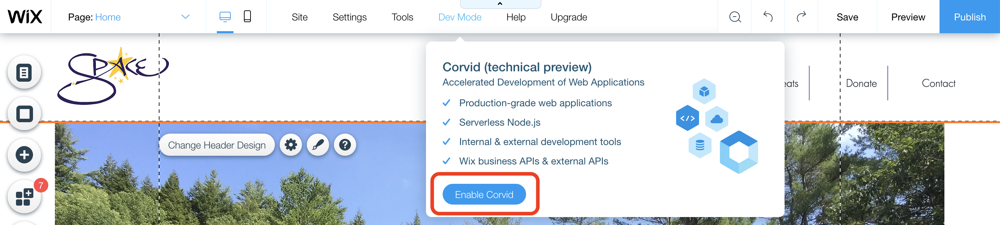
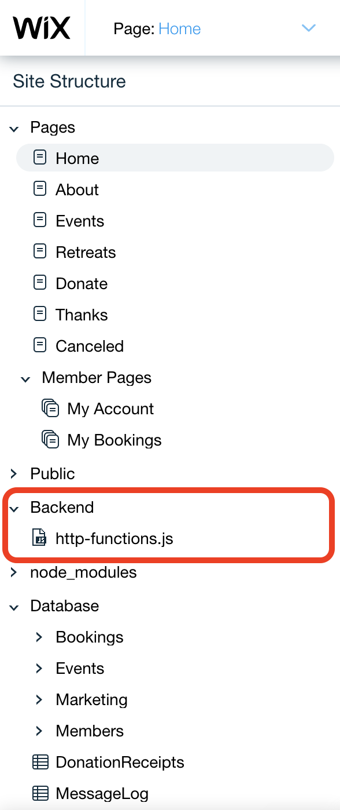
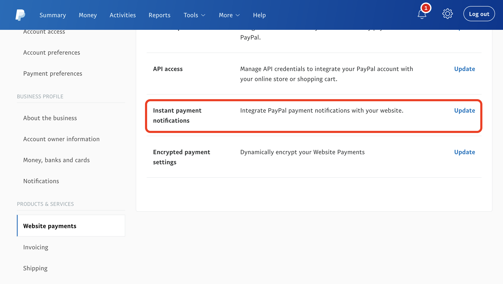

This is a quick-and-dirty explanation of how to add a PayPal IPN listener to a Wix website using Corvid. I've also put my `http-functions.js` file in a gist, which is accessible [here](https://gist.github.com/morkhorwaad/4596b05d02a130069deed76496db8c0f).

_If you just want to see the code, skip down to the <a class="internal-link" href="#all-the-rest">All The Rest</a> section._ 

## My why

Last year, I built [a website](https://spaceinvermont.org) for my mom's nonprofit, SPACE. For a lot of reasons, we decided that the best option was to go with a site builder solution, so I put the site together for her with Wix. 

She wanted a way for people to be able to donate, and to get the site up as quickly as possible. A PayPal account was already set up, so I plopped in [PayPal Button](https://www.paypal.com/lc/webapps/mpp/buttons). However, we realized that with just a button, 'Thank You' emails wouldn't be sent out.

After poking around for a bit through documentation, I found that PayPal has a neat little service called [Instant Payment Notification](https://developer.paypal.com/docs/classic/products/instant-payment-notification/). This lets the entity with a PayPal account get notified whenever their account was paid, and get some of the information on the transaction. 

Getting set up with the service is straightforward: there needs to be a small API endpoint set up that listens for these notifications, and can authenticate itself to get the real information. With Wix Corvid (or Wix Code, or Dev Mode, whatever they're calling it), an endpoint can be added pretty easily!

## Doing it

### The plan 

1. Create an endpoint that can be POSTed to using the _https-functions.js_ file that Wix exposes
2. Flesh out the listener logic, and test using the IPN Sandbox that PayPal provides
3. Configure the PayPal account to be using the IPN endpoint created
4. Profit!

### Creating an endpoint

To start working on this, Dev Mode has to be turned on. When in the editor of your site, click the 'Dev Mode' button in the header, and then 'Enable Corvid'. This will open up a navigation pane on the left side of the screen, with pages, databases, server functionality, and more. 



With this open, make a new file in the `Backend` folder called `http-functions.js`. This is where API endpoints can be defined, provided the naming convention is consistent with what Wix expects. Documentation on this is [here](https://www.wix.com/corvid/reference/wix-http-functions.html), and goes into greater depth. 



Wix will recognize and treat functions as endpoints when they are exported, and named with the convention `{HTTPVERB}_{EndpointName}`. 

The IPN listener is expecting a POST endpoint, so to create one, write a new function definition with the name 'post_IPNListener', or 'post_yourFunctionName'. It should take in one parameter, the request.

```javascript
export function post_IPNListner(request) {
    console.log("In the IPN listner!");
}
```

These endpoints can be tested before the push to production, and can be reached at `https://{yourSite}/_functions-dev/{yourFunctionName}` when the site is being previewed. A console can also be brought up to view debug statements as well, which helped me quite a bit during this whole process.

By using [Postman](https://www.getpostman.com/) or some other tool, a POST to `https://{site}/_functions-dev/post_IPNListener` with just the snippet above in the `http-functions.js` should yield the "In the IPN Listener!" message. 

### Adding the listener logic

The _https-functions.js_ file that I use is below, and I'm going to walk through it step-by-step. Even before that, a few big pieces: 

#### Async? 

The logic is entirely separated from the endpoint function, and this is for a good reason. PayPal expects an OK response from its notification as soon as it's received (and before verification). To achieve this, the verification process is kicked off asynchronously with [`SetTimeout`](https://developer.mozilla.org/en-US/docs/Web/API/WindowOrWorkerGlobalScope/setTimeout) before an OK is sent back. This also means that both functions have to be marked as `async`. 

#### Test and Production

To make life easier, PayPal provides an [IPN Simulator](https://developer.paypal.com/docs/classic/ipn/integration-guide/IPNSimulator/#ipn-listener-requirements) that will generate IPN posts directed at your endpoint. I've left this testing endpoint coded into my example, but you'll have to log in to PayPal Developer and register your endpoint before it will work properly. 

#### Debug messages
In the gist posted, there are references to undefined functions: `logDebugMessage` and `logErrorMessages`. I set up error message databases when I built this, and I didn't want to convolute this explanation with setting up the databases. These can be replaced with console statements, or whatever logging system is most appropriate. The [documentation on databases](https://support.wix.com/en/article/corvid-working-with-the-data-api) is solid if you want to get into that. 

<h4 id="all-the-rest">All the rest</h4>

`gist:morkhorwaad/4596b05d02a130069deed76496db8c0f#http-functions.js`

With the reason for `async` explained, I'll just focus on the `verifyIPNRequest` function, which gets the parsed body of the POST request. 

PayPal expects a verification POST to come _back_, so the first thing that's done is putting together the fetch options for the request. It's a POST, with the expected body to be exactly what was sent, except with `"cmd=_notify-validate&"` prepended. 

Before this is sent, the original message body is saved and parsed, because if it's verified as a real message, the data is good and usable. 

Once the verification message is put together, it is sent using `fetch`. When a response comes in, there are a series of checks to make on the data: 

- _Is the transaction verified?_
    - The body of the response will be the string `'VERIFIED'` if the message is good, and this is the first thing to check. 
- _Is the transaction complete?_
    - Information is also sent on pending, incomplete, and other transaction states. In my case, and probably most others, only completed transactions are of interest. 
- _Does the transaction have an email that is recognized and trusted associated with the expected recipient?_
    - We only want information on money coming _in_, not going anywhere else. 

After these criteria are met, business logic can be executed. In my case, I logged the message, and if it was production, sent a thank you email! 

This can be tested thoroughly in Preview mode, and I would recommend it. The IPN Simulator allows you to change all of the fields getting tested to make sure the filters are appropriate and working as expected. I didn't find a better way of testing in production than just donating a dollar, but I was able to PayPal it right back afterward. 

Also, be sure to actually publish your changes once testing requirements have been satisfied. That helps. 

Before production testing can be done, the PayPal account has to be configured to use the new endpoint that's been set up. 

### Configuring the PayPal account

To actually turn on these notifications, all that has to be done is provide the address of the POST endpoint created, and flip a switch. 

After logging into PayPal, navigate to your Profile. On the navigation panel, in the 'Products and Services' section, click 'Website Payments'. On this page, there should be an option to update your Instant Payment Notification settings &mdash; that's where to go. 



Once there, enter in the production endpoint. With Wix, again, it varies depending on whether it's a free or a premium site. The one I was working on was premium, so my endpoint was `https://{mySite}/_functions/{myFunctionName}`. Also, be sure to select 'Receive IPN Messages (Enabled)'. 

## That's it! 

The process was straightforward, but I hadn't seen any guides on doing this though Wix, so I thought I'd put one together. Have fun with all that notification information!


